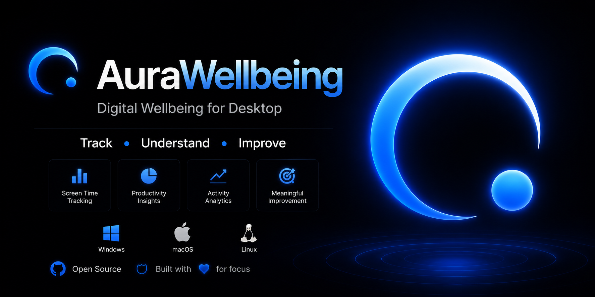

# Aura Wellbeing

A premium, privacy-first, cross-platform digital wellbeing and productivity tracking desktop application. Built with **Tauri v2**, **React**, **TypeScript**, **Rust**, and **SQLite**. 

Aura Wellbeing runs completely locally to track active application usage, analyze trends, monitor focus blocks, and help you maintain a healthy digital lifestyle without compromising your privacy.

---


## Key Features

- **Intelligent Active App Tracking**: Monitors foreground window transitions and user activity levels (idle detection) using high-performance, native Rust APIs.
- **Absolute Privacy-First (Local SQLite)**: All tracking data, settings, and goals are saved in a local SQLite database (`aura_wellbeing.db`). No cloud sync, no tracking servers, no leaks.
- **Dynamic Interactive Dashboard**: High-fidelity, custom-designed charts and heatmaps visualizing hourly usage distributions, categories, and specific app trends.
- **Focus Mode & Goals**: Configure custom focus sessions and daily usage limit goals with real-time tracking to stay disciplined.
- **Premium macOS-Inspired UI**: A gorgeous, fluid, frosted-glass interface with pixel-perfect responsive layouts, smooth micro-animations, and complete custom dark/light modes.
- **Seamless System Tray Integration**: Operates silently in the background, featuring "Close to Tray" and left-click to toggle the GUI or right-click to control the application.
- **Intelligent Autostart**: System startup integration for Windows, macOS, and Linux, starting silently in the background on login (without opening the GUI window).

---

## Technology Stack

- **Frontend**: React 19, TypeScript, Recharts (custom styled), Lucide React Icons
- **Backend & Native Integration**: Rust, Tauri v2
- **Database**: SQLite (via SQLx)
- **Styling**: Pure CSS with responsive viewport calculations, HSL theme tokens, and dynamic CSS-variable dark mode.

---

## Getting Started

### Prerequisites

1. **Node.js**: v18 or later
2. **Rust & Cargo**: Latest stable toolchain (see [Tauri Prerequisites](https://v2.tauri.app/start/prerequisites/))
3. **Platform Build Tools**:
   - **Windows**: Build Tools for Visual Studio 2022 (C++ desktop development workload)
   - **macOS**: Xcode Command Line Tools
   - **Linux**: Build essentials, `webkit2gtk`, and system library dependencies

### Development Setup

1. **Clone the repository:**
   ```bash
   git clone https://github.com/harshshah6/AuraWellbeing
   cd pc-digital-wellbeing
   ```

2. **Install dependencies:**
   ```bash
   npm install
   ```

3. **Run the application in development mode:**
   ```bash
   npm run tauri:dev
   ```

---

## Production Builds

Build highly optimized, native installers for your current platform:

```bash
# General production build
npm run tauri:build

# Target-specific installers (configured for releases)
npm run tauri:build-win     # Generates NSIS (.exe) and MSI installers
npm run tauri:build-linux   # Generates Debian (.deb) and AppImage packages
npm run tauri:build-mac     # Generates DMG and Apple App packages
```

Output bundles are placed under `src-tauri/target/release/bundle/`.

---

## Utilities

Clean up large build directories and Vite cache to free up disk space:

```bash
npm run clean
```
*This removes build directories (`dist`, `src-tauri/target`), generated schemas, and cache folders.*

---

## Architecture & Core Files

- **`src-tauri/src/tracker.rs`**: Core Rust monitor querying native OS active window handles (e.g., Win32 API) and tracking active times.
- **`src-tauri/src/db.rs`**: SQLite initialization, migrations, and clean interface for storing tracking logs.
- **`src-tauri/src/lib.rs`**: System tray lifecycle management, window behavior, and event listeners.
- **`src-tauri/src/commands.rs`**: Safe IPC bridge commands mapping React states directly to the Rust system layer (e.g., autostart registry configs, focus states).
- **`src/App.tsx`**: Dynamic dashboard UI routing between Dashboard, Insights, Goals, Focus, and Settings.
- **`design.md`**: Master design layout containing layout structures, spacing guidelines, typography tokens, and light/dark HSL themes.

---

## CI/CD Deployment

The project includes a fully automated GitHub Actions pipeline under `.github/workflows/release.yml`. When you push a tag matching `v*` (e.g. `v1.0.0`), the workflow:
1. Runs compilation and bundling for Windows, macOS, and Linux.
2. Compiles for both Intel and Apple Silicon architectures on macOS.
3. Automatically drafts a GitHub Release containing all installer assets (.exe, .msi, .dmg, .deb, .AppImage).
